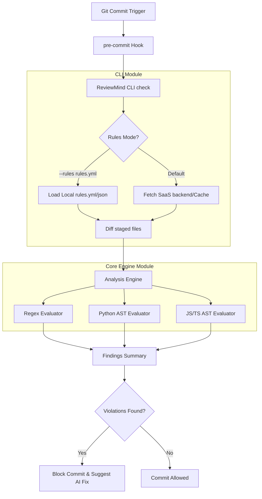

# ReviewMind CLI Architecture & Developer Guide

This document describes the internal design, architecture, and module structure of the `reviewmind-cli` repository. It is intended to help developers understand how the CLI works, how to extend it, and how to run it in various modes.

---

## 1. Overview

ReviewMind CLI serves two primary purposes:
1. **Developer CLI Tool**: Enforces custom coding guidelines and review rules locally before commits are finalized (`pre-commit` hook).
2. **Core Scanning Engine (`reviewmind.engine`)**: A decoupled, open-source library that parses source code files, runs Regex and AST (Abstract Syntax Tree) patterns, and reports rule violations.

---

## 2. Directory Structure

```
reviewmind-cli/
├── .github/
│   └── workflows/
│       └── ci.yml             # Github Actions workflow (Lint, Formatting, Tests, PyPI Release)
├── reviewmind/                # Unified parent namespace package
│   ├── __init__.py            # Main library entrypoint
│   ├── cli/                   # The CLI sub-package
│   │   ├── cache.py           # Handles locally caching rules for offline mode
│   │   ├── check.py           # Core logic for checking staged files (API sync + local files scan)
│   │   ├── config.py          # Handles CLI authorization tokens & configuration storage
│   │   ├── main.py            # Typer-based CLI command-line router & interface
│   │   └── setup.py           # Installs the pre-commit hook in local .git/hooks/
│   └── engine/                # Decoupled core evaluation engine
│       ├── __init__.py
│       ├── analysis_engine.py # Orchestrates AST and Regex scanners over active files
│       ├── engine_rule.py     # Data models and structures for rules
│       ├── finding.py         # Data models for scan violations/findings
│       ├── evaluators/        # Evaluation engines per file type
│       │   ├── __init__.py
│       │   ├── base.py            # Base abstract class for all evaluators
│       │   ├── js_ast_evaluator.py # JavaScript/TypeScript AST scanner
│       │   ├── python_ast_evaluator.py # Python AST parser and scanner
│       │   └── regex_evaluator.py  # Regex matcher
│       └── exporters/         # Output formatting
│           ├── __init__.py
│           └── sarif_exporter.py  # Exports findings in standard SARIF format
└── tests/
    └── test_engine.py         # Pytest test suite for engine evaluators
```

---

## 3. High-Level Architecture Design



---

## 4. Components

### A. CLI Module (`reviewmind/cli/`)
The CLI manages system interactions, user configuration, git hooks, and CLI inputs/outputs.
- **`main.py`**: Router using the `typer` framework. It supports three major commands:
  - `reviewmind setup`: Installs a git pre-commit hook in `.git/hooks/pre-commit` pointing to the CLI.
  - `reviewmind config`: Sets up user token credentials.
  - `reviewmind check`: Orchestrates diffing, rule-loading, scanner execution, and auto-fix prompts.
- **`check.py`**: Interacts with Git to extract staged lines using `git diff --cached --unified=0`.
- **`cache.py`**: Safely caches fetched rules locally so that scans still work if the developer goes offline.

### B. Core Engine Module (`reviewmind/engine/`)
The engine is decoupled from the CLI shell and could theoretically be packaged as an independent library.
- **`AnalysisEngine`**: Takes a list of `EngineRule` objects and files to scan, filters out ignored paths (defined in `.reviewmind.yml`), maps files to languages, and triggers appropriate evaluators.
- **Evaluators**:
  - **`RegexRuleEvaluator`**: Scans files using regular expressions. Great for fast matches (e.g., matching unwanted imports or banned keywords).
  - **`PythonASTRuleEvaluator`**: Parses Python scripts into an Abstract Syntax Tree (AST) to check for unsafe function calls (e.g., `eval()`, `exec()`) precisely.
  - **`JavaScriptASTRuleEvaluator`**: Scans JS/TS patterns.
- **Exporters**: Exports results into the SARIF (Static Analysis Results Interchange Format) format so security logs can integrate with dashboards like GitHub Code Scanning.

---

## 5. Execution Modes

### Mode 1: Connected Mode (Default)
In this mode, rules are synced with the **ReviewMind SaaS Dashboard**:
1. When running `reviewmind check`, the CLI contacts the SaaS API to fetch the active rules customized for the current Git repository.
2. If the API is unreachable, it seamlessly falls back to caching rules in `cache.py`.
3. If violations are found, they are reported back to the ReviewMind server to sync dashboards, and commits are blocked.

### Mode 2: Standalone Mode (Local rules.yml)
Allows developers to use the tool completely offline/locally without creating any SaaS account:
1. Run with `--rules <path>`:
   ```bash
   reviewmind check --rules rules.yml
   ```
2. Auth verification and remote logging are skipped.
3. Rules are parsed from the specified local YAML or JSON file.

---

## 6. Extending ReviewMind

If you are contributing to this repository, here is how you can expand its features:

### Adding a new Evaluator (Language/Type)
1. Subclass `RuleEvaluator` in [reviewmind/engine/evaluators/base.py](file:///c:/All%20Data/Projects/reviewmind-cli/reviewmind/engine/evaluators/base.py).
2. Override `evaluate_file` method.
3. Register the new evaluator in `AnalysisEngine.run_scan()` inside [reviewmind/engine/analysis_engine.py](file:///c:/All%20Data/Projects/reviewmind-cli/reviewmind/engine/analysis_engine.py).
4. Add corresponding tests inside [tests/test_engine.py](file:///c:/All%20Data/Projects/reviewmind-cli/tests/test_engine.py).
